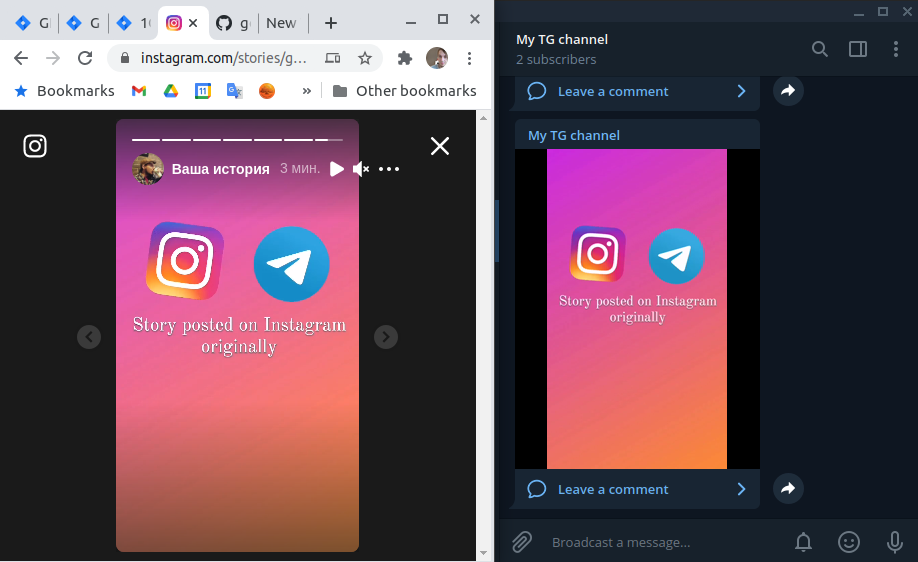

##  Utility to automate crossposting of  IG stories to TG

App will poll Instagram periodically, check if new stories appeared on your account and crosspost them to Telegram chat you have specified.  
Traffic friendly: it does not reupload any media, instead it passes data over URL.  
  
Configuration is located in `config.yml` file which should be stored together with binary.
You will need to register TG bot before (TG account [@botfather](tg://resolve?domain=botfather) will help with that).  
Also remember you might need to [disable group privacy for bot ](https://stackoverflow.com/questions/50204633/allow-bot-to-access-telegram-group-messages "disable group privacy for bot ").  
After that add your bot to target chat and copy [ID of this chat](https://stackoverflow.com/questions/32423837/telegram-bot-how-to-get-a-group-chat-id "ID of this chat") to config file.

